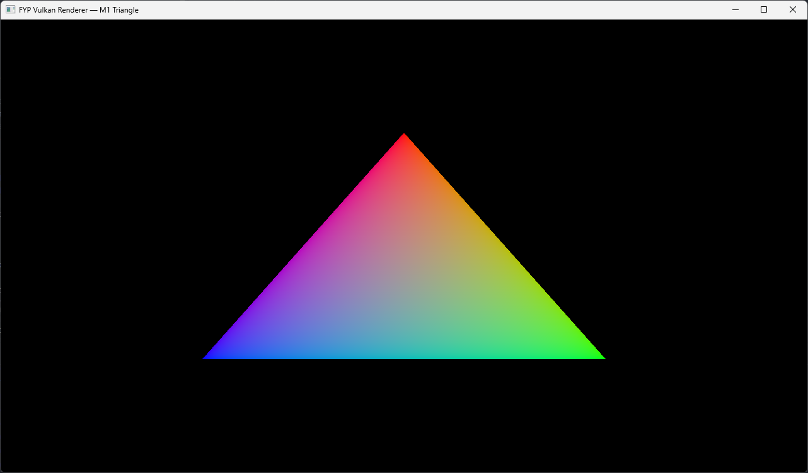
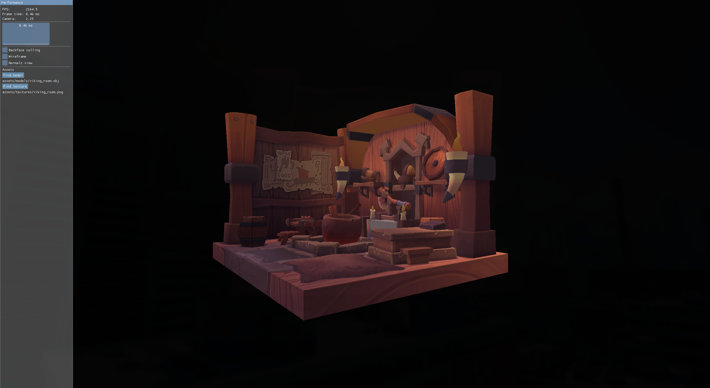
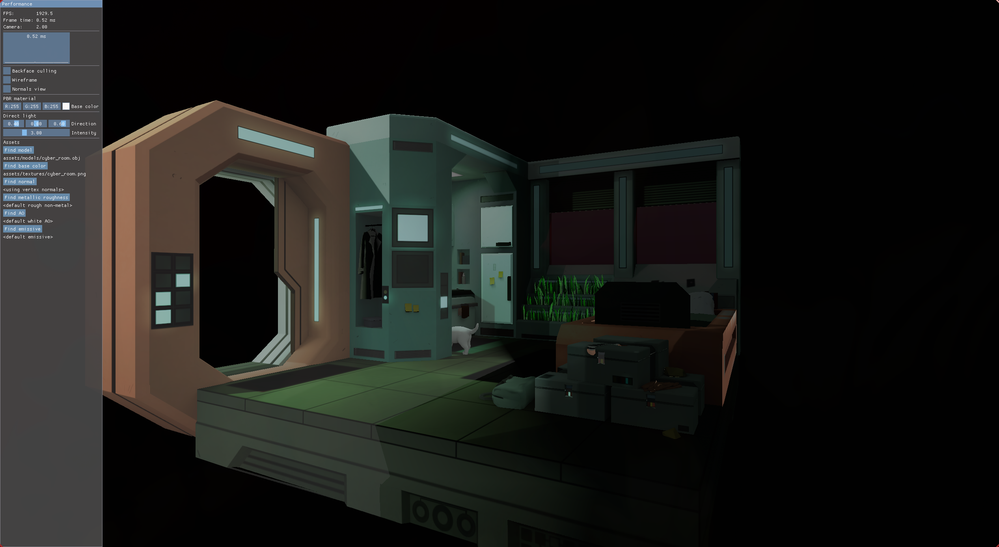
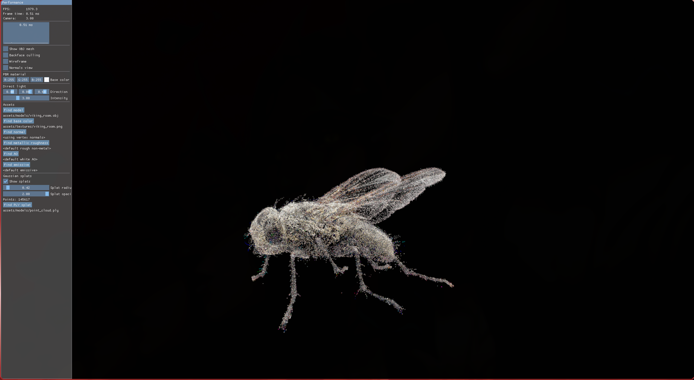

# Raiju Renderer

[](https://en.cppreference.com/w/cpp/20)
[](https://registry.khronos.org/vulkan/)
[](https://cmake.org/)
[](#build-and-run)
[](LICENSE)

**Release state:** v0.3.0 Gaussian Splat Prototype / Final Year Project  
**Renderer version:** Textured OBJ + experimental Gaussian-style PLY splat vertical slice  
**Graphics API:** Vulkan 1.3  
**Language:** C++20  
**Platforms:** Linux and Windows  

Raiju Renderer is a compact real-time Vulkan renderer built to make explicit GPU programming visible, inspectable, and explainable. It demonstrates the full path from loading assets on disk to presenting rendered frames on screen through Vulkan instance/device setup, swapchain management, command recording, GPU uploads, synchronisation, Dynamic Rendering, descriptor binding, texture sampling, depth testing, debug UI, and presentation.

This is not a general-purpose game engine. It is a focused renderer prototype developed as my Final Year Project at De Montfort University, with a longer-term direction towards real-time rendering research, neural rendering workflows, Gaussian splatting, and game-ready asset reconstruction.

---

## Contents

- [Screenshots](#screenshots)
- [Project Goals](#project-goals)
- [Current Features](#current-features)
- [What This Project Is Not](#what-this-project-is-not)
- [Requirements](#requirements)
- [Build and Run](#build-and-run)
- [Controls and Debug UI](#controls-and-debug-ui)
- [Architecture](#architecture)
- [Frame Overview](#frame-overview)
- [Project Structure](#project-structure)
- [Development Notes](#development-notes)
- [Dependencies](#dependencies)
- [Roadmap](#roadmap)
- [Academic Context](#academic-context)
- [Asset Credits](#asset-credits)
- [References](#references)
- [License](#license)

---

## Screenshots

<p align="center">
  
  <br/>
  <em>Milestone 1: first Vulkan 1.3 render path using Dynamic Rendering.</em>
</p>

<p align="center">
  
  <br/>
  <em>Milestone 2: textured OBJ model rendered with vertex/index buffers, texture sampling, depth testing, and debug UI.</em>
</p>

<p align="center">
  
  <br/>
  <em>Current textured OBJ path with live ImGui inspection controls.</em>
</p>

<p align="center">
  
  <br/>
  <em>Experimental Gaussian-style PLY splat rendering through the same Vulkan renderer framework.</em>
</p>

---

## Project Goals

Raiju Renderer was created to explore low-level real-time rendering without hiding the important GPU concepts behind a large engine abstraction.

The main goals are to:

- build a compact Vulkan 1.3 renderer with an understandable code structure;
- demonstrate a complete rendering vertical slice from asset loading to presentation;
- keep memory ownership, synchronisation, image layouts, command buffers, and queue submission explicit;
- use Vulkan Dynamic Rendering instead of legacy render pass and framebuffer setup;
- provide clear debugging and evaluation evidence through ImGui, validation layers, screenshots, and RenderDoc;
- create a foundation for future graphics research, including PBR, scene loading, Gaussian splatting, and neural rendering workflows.

Modern engines such as Unreal Engine and Unity are excellent production tools, but they intentionally abstract away many renderer-level decisions. This project keeps those details visible so they can be inspected, explained, tested, and extended.

---

## Current Features

### Rendering

- Vulkan 1.3 renderer
- Dynamic Rendering based draw path
- No legacy `VkRenderPass`
- No legacy `VkFramebuffer`
- Depth attachment support
- Textured OBJ rendering
- Indexed mesh drawing
- Cook-Torrance direct PBR lighting
- Mipmap generation for loaded textures
- Optional PBR texture slots:
  - base colour
  - metallic/roughness
  - ambient occlusion
  - emissive
  - reserved normal map slot
- Experimental ASCII and binary-little-endian `.ply` Gaussian-style splat rendering
- Debug normals view
- Wireframe pipeline variant
- Optional back-face culling
- Simple camera and model inspection controls

### Vulkan Systems

- Vulkan instance, device, queue, and surface setup through `vk-bootstrap`
- Swapchain creation and presentation
- Vulkan Memory Allocator based GPU memory allocation
- Staging-buffer uploads for mesh and texture data
- Explicit image layout transitions
- `VK_KHR_synchronization2` style barriers
- Two frames in flight
- Per-image render-finished semaphores
- Resize-safe swapchain recreation
- Validation-layer focused development workflow

### Tooling

- CMake 3.25+ build system
- vcpkg manifest dependencies
- Shader compilation through `glslc`
- Linux and Windows build presets
- Runtime ImGui debug overlay
- RenderDoc-friendly frame structure
- Optional Doxygen documentation
- Prototype evidence stored under `docs/prototype-evidence/`

---

## What This Project Is Not

Raiju Renderer is deliberately scoped as a renderer prototype, not a full engine.

It does not currently aim to provide:

- an entity component system;
- physics;
- animation;
- audio;
- editor tooling;
- scripting;
- gameplay systems;
- a full scene graph;
- production asset cooking;
- general-purpose engine abstractions.

The focus is renderer correctness, explicit Vulkan control, technical reflection, and a stable foundation for future graphics experiments.

---

## Requirements

### Software

| Requirement | Version / Notes |
| --- | --- |
| Operating system | Linux or Windows |
| Compiler | C++20 capable compiler |
| Build system | CMake 3.25+ |
| Package management | vcpkg manifest mode |
| Graphics API | Vulkan 1.3 |
| Shader compiler | `glslc`, usually provided by the Vulkan SDK |
| Debug tooling | Vulkan validation layers and RenderDoc recommended |

### Hardware

| Requirement | Minimum |
| --- | --- |
| CPU | Modern quad-core CPU |
| RAM | 8 GB |
| GPU | Vulkan 1.3 capable GPU |
| Storage | Enough space for dependencies, build outputs, shaders, and assets |

The renderer is lightweight, but a Vulkan 1.3 capable driver is required.

---

## Build and Run

### 1. Clone the Repository

```bash
git clone https://github.com/Raiju-Deeq/FYP-Vulkan-Renderer.git
cd FYP-Vulkan-Renderer
```

---

### 2. Linux

Install Vulkan tooling and development packages.

On Arch-based systems:

```bash
sudo pacman -S vulkan-radeon vulkan-validation-layers cmake ninja git base-devel
```

Set up vcpkg:

```bash
git clone https://github.com/microsoft/vcpkg "$HOME/vcpkg"
"$HOME/vcpkg/bootstrap-vcpkg.sh"

export VCPKG_ROOT="$HOME/vcpkg"
```

Configure and build:

```bash
cmake --preset linux-debug
cmake --build --preset linux-debug
```

Run with validation layers enabled:

```bash
VK_INSTANCE_LAYERS=VK_LAYER_KHRONOS_validation ./build/linux-debug/vulkan-renderer
```

---

### 3. Windows

Set up vcpkg from PowerShell:

```powershell
git clone https://github.com/microsoft/vcpkg "$env:USERPROFILE\vcpkg"
& "$env:USERPROFILE\vcpkg\bootstrap-vcpkg.bat"

$env:VCPKG_ROOT = "$env:USERPROFILE\vcpkg"
$env:PATH = "$env:VCPKG_ROOT;$env:PATH"
```

Configure and build:

```powershell
cmake --preset uni-debug
cmake --build --preset uni-debug
```

Run the generated executable from the build output directory.

---

### Build Presets

| Preset | Platform | Configuration | Purpose |
| --- | --- | --- | --- |
| `linux-debug` | Linux | Debug | Development build with validation-focused workflow |
| `linux-release` | Linux | Release | Optimised Linux build |
| `uni-debug` | Windows | Debug | Windows/university lab development build |
| `uni-release` | Windows | Release | Optimised Windows build |

---

### Runtime Notes

CMake copies the required runtime assets and compiled shaders into the build output directory so the executable can locate the active model, texture, and SPIR-V shader files.

During a demo or validation pass, check that:

- the textured OBJ model renders correctly;
- the ImGui overlay is visible;
- frame time and FPS update correctly;
- wireframe mode switches pipeline state;
- normals view changes the fragment output;
- back-face culling can be toggled;
- resizing and minimising the window does not crash;
- validation layers do not report critical errors.

---

## Controls and Debug UI

The current prototype exposes renderer inspection through ImGui.

| Control / Display | Purpose |
| --- | --- |
| FPS and frame time | Shows runtime performance during development and demos |
| Camera distance | Allows the active model to be inspected more clearly |
| Wireframe toggle | Shows mesh topology and pipeline variant switching |
| Back-face culling toggle | Demonstrates rasterizer state changes |
| Normals view | Visualises imported and interpolated normals |
| Asset path display | Shows which model and texture are currently active |
| Splat mode controls | Supports inspection of the experimental PLY splat path |

---

## Architecture

Raiju Renderer is organised around a small set of explicit systems rather than a broad engine framework.

| System | Responsibility |
| --- | --- |
| `Application` | Startup, main loop, debug UI, asset selection, resize handling, and teardown |
| `AppWindow` | GLFW window creation, event polling, and framebuffer state |
| `VulkanContext` | Instance, device, queues, surface, debug messenger, and VMA allocator |
| `SwapChain` | Swapchain images, image views, depth resources, and rebuild logic |
| `GraphicsPipeline` | Shader modules, descriptor layouts, pipeline layouts, and rasterizer variants |
| `Renderer` | Command buffers, fences, semaphores, frame submission, and ImGui rendering |
| `GpuBuffer` | Buffer/image creation, staging uploads, and layout transitions |
| `Mesh` | OBJ loading, vertex/index data generation, and GPU mesh buffers |
| `GaussianSplat` | ASCII/binary `.ply` point ingestion, storage buffer upload, and billboard splat rendering |
| `Material` | Texture loading, image views, samplers, and descriptor sets |

---

## Frame Overview

At a high level, one rendered frame follows this path:

1. Poll window events.
2. Update ImGui and frame metrics.
3. Build the model-view-projection matrix.
4. Wait for the current frame fence.
5. Acquire the next swapchain image.
6. Reset and record the command buffer.
7. Transition colour and depth images into attachment layouts.
8. Begin Vulkan Dynamic Rendering.
9. Bind the selected graphics pipeline variant.
10. Bind descriptor sets.
11. Bind vertex and index buffers, or splat storage data depending on the active mode.
12. Push MVP/debug constants.
13. Issue draw commands.
14. Render the ImGui overlay.
15. End Dynamic Rendering.
16. Transition the colour image for presentation.
17. Submit the command buffer.
18. Present the swapchain image.
19. Rebuild swapchain-dependent resources if required.

---

## Project Structure

```text
FYP-Vulkan-Renderer/
├── CMakeLists.txt
├── CMakePresets.json
├── vcpkg.json
├── vcpkg-configuration.json
├── README.md
├── LICENSE
├── Doxyfile
├── index.html
├── src/
│   ├── main.cpp
│   ├── application.hpp / application.cpp
│   ├── window.hpp / window.cpp
│   ├── vulkan_context.hpp / vulkan_context.cpp
│   ├── swapchain.hpp / swapchain.cpp
│   ├── frame_data.hpp / frame_data.cpp
│   ├── graphics_pipeline.hpp / graphics_pipeline.cpp
│   ├── gpu_buffer.hpp / gpu_buffer.cpp
│   ├── mesh.hpp / mesh.cpp
│   ├── gaussian_splat.hpp / gaussian_splat.cpp
│   └── texture.hpp / texture.cpp
├── shaders/
│   ├── triangle.vert
│   ├── triangle.frag
│   ├── mesh.vert
│   ├── mesh.frag
│   ├── splat.vert
│   └── splat.frag
├── assets/
│   ├── models/
│   └── textures/
└── docs/
    ├── dev-log/
    ├── prototype-evidence/
    └── wiki/
```

---

## First Places to Look

If you are reading the codebase for the first time, start with:

1. `src/main.cpp`  
   Entry point. Creates and runs the application.

2. `src/application.cpp`  
   Coordinates the application lifecycle, debug UI, asset selection, and render loop.

3. `src/vulkan_context.cpp`  
   Creates the Vulkan instance, device, queues, surface, debug messenger, and allocator.

4. `src/swapchain.cpp`  
   Handles swapchain creation, image views, depth resources, and resize recovery.

5. `src/frame_data.cpp`  
   Contains frame synchronisation and command submission logic.

6. `src/graphics_pipeline.cpp`  
   Builds shader modules, pipeline layouts, Dynamic Rendering state, and pipeline variants.

7. `src/mesh.cpp` and `src/texture.cpp`  
   Load CPU-side asset data and upload it to GPU resources.

8. `src/gaussian_splat.cpp`  
   Handles the experimental PLY splat ingestion and rendering path.

---

## Development Notes

### Design Principles

- Prefer explicit ownership over hidden global state.
- Keep Vulkan object lifetime and teardown order clear.
- Use RAII-style wrappers where they improve safety.
- Treat validation layer errors as blocking defects.
- Keep the main render path based on Dynamic Rendering.
- Avoid legacy `VkRenderPass` and `VkFramebuffer` usage in the main path.
- Keep synchronisation visible and explainable.
- Prioritise correctness and evaluation evidence over feature volume.
- Keep the project small enough to explain in a final-year technical report.
- Document major systems with Doxygen comments where useful.

### Synchronisation Notes

The renderer uses two frames in flight and keeps synchronisation deliberately explicit. Frame fences, image acquisition, render-finished semaphores, command buffer recording, and presentation are handled in a way that can be inspected and discussed in the final report.

The project also uses per-image render-finished semaphores so semaphore reuse is tied to the swapchain image being presented rather than only to the frame index.

### Swapchain Recreation

The renderer rebuilds swapchain-dependent resources when resize, minimise, out-of-date, or suboptimal presentation events require it. The rebuild path is intentionally visible because swapchain recovery is one of the most important reliability tests for a Vulkan renderer.

---

## Dependencies

Third-party dependencies are managed through vcpkg manifest mode.

| Library | Purpose |
| --- | --- |
| [Vulkan SDK](https://vulkan.lunarg.com/) | Core graphics API, validation layers, and shader tools |
| [vk-bootstrap](https://github.com/charles-lunarg/vk-bootstrap) | Vulkan instance, device, queue, and swapchain setup helper |
| [GLFW](https://www.glfw.org/) | Window creation and input |
| [GLM](https://github.com/g-truc/glm) | Maths library |
| [Vulkan Memory Allocator](https://gpuopen-librariesandsdks.github.io/VulkanMemoryAllocator/html/) | GPU memory allocation |
| [tinyobjloader](https://github.com/tinyobjloader/tinyobjloader) | OBJ mesh loading |
| [stb_image](https://github.com/nothings/stb) | Texture loading |
| [Dear ImGui](https://github.com/ocornut/imgui) | Runtime debug UI |
| [spdlog](https://github.com/gabime/spdlog) | Logging |

---

## Roadmap

### Completed

- [x] Window creation
- [x] Vulkan 1.3 setup
- [x] Swapchain creation and presentation
- [x] Dynamic Rendering path
- [x] Textured OBJ rendering
- [x] Vertex and index buffer uploads
- [x] Texture loading and sampling
- [x] Depth testing
- [x] Runtime ImGui debug UI
- [x] Wireframe pipeline variant
- [x] Debug normals view
- [x] Back-face culling toggle
- [x] Frame timing display
- [x] Resize-safe rendering
- [x] Mipmap generation
- [x] Cook-Torrance direct PBR lighting
- [x] Experimental Gaussian-style `.ply` splat rendering

### In Progress

- [ ] Final report and evaluation
- [ ] Additional RenderDoc evidence
- [ ] Build troubleshooting guide
- [ ] Cleaner documentation pages
- [ ] Improved asset loading notes

### Future Work

- [ ] Anisotropic filtering
- [ ] Scene loading
- [ ] Shadow mapping
- [ ] More complete PBR material workflow
- [ ] glTF support
- [ ] Improved camera controls
- [ ] Gaussian splat sorting and blending improvements
- [ ] Mesh extraction experiments from Gaussian splats
- [ ] Neural material or relightable asset experiments

---

## Academic Context

**Programme:** BSc (Hons) Games Production  
**Institution:** De Montfort University, Leicester  
**Author:** Mohamed Deeq Mohamed  
**Supervisor:** Salim Hasshu  
**Project type:** Final Year Project  
**Focus:** Vulkan rendering fundamentals, explicit GPU programming, technical reflection, renderer evaluation, and future neural rendering research  

The final report evaluates the renderer through:

- Vulkan 1.3 setup and design rationale;
- Dynamic Rendering implementation;
- mesh and texture upload paths;
- swapchain recreation behaviour;
- synchronisation correctness;
- debug visualisation;
- runtime inspection through ImGui;
- screenshots and prototype evidence;
- validation layer output;
- RenderDoc captures;
- known limitations and future work.

---

## Asset Credits

The prototype currently uses small demonstration assets under `assets/models/` and `assets/textures/`.

When larger or third-party assets are added, they should be credited here with:

- asset name;
- original author;
- licence;
- source link;
- modifications made for use in the renderer.

---

## References

- [Vulkan 1.3 Specification](https://registry.khronos.org/vulkan/specs/1.3/html/)
- [Vulkan Guide](https://vkguide.dev/)
- [Vulkan Dynamic Rendering](https://docs.vulkan.org/refpages/latest/refpages/source/VK_KHR_dynamic_rendering.html)
- [Vulkan Swapchain Semaphore Reuse Guidance](https://docs.vulkan.org/guide/latest/swapchain_semaphore_reuse.html)
- [vk-bootstrap](https://github.com/charles-lunarg/vk-bootstrap)
- [Vulkan Memory Allocator](https://gpuopen-librariesandsdks.github.io/VulkanMemoryAllocator/html/)
- [RenderDoc](https://renderdoc.org/)
- [tinyobjloader](https://github.com/tinyobjloader/tinyobjloader)
- [stb](https://github.com/nothings/stb)
- [3D Gaussian Splatting for Real-Time Radiance Field Rendering](https://repo-sam.inria.fr/fungraph/3d-gaussian-splatting/)

---

## License

This project is licensed under the [MIT License](LICENSE).
