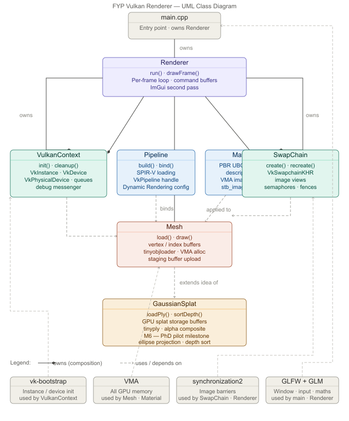

<p align="center">
  <i>Screenshot will be placed here once M1 is complete</i>
</p>

# Vulkan Renderer

A real-time Vulkan 1.3 renderer built from scratch in C++20, using Dynamic Rendering exclusively.
No `VkRenderPass`. No `VkFramebuffer`. All synchronisation through `synchronization2`.
All GPU memory through VMA.

Built as a Final Year Project at De Montfort University (BSc Games Production, 2025-2026)
and as a foundation for PhD research in neural rendering (starting October 2026).

[](https://en.cppreference.com/w/cpp/20)
[](https://registry.khronos.org/vulkan/)
[](https://cmake.org/)
[](#getting-started)
[](LICENSE)

---

## Academic Context

**Programme:** BSc (Hons) Games Production, De Montfort University, Leicester
**Author:** Mohamed Deeq Mohamed (P2884884)
**Supervisors:** Salim Hashu, Dr Conor Fahy
**PhD:** Neural Rendering at DMU, starting October 2026

The Gaussian Splatting milestone (M6) is a deliberate pilot for the PhD, bridging
real-time Vulkan rendering with neural radiance field representations.

Full project documentation lives in the [Obsidian Vault](docs/FYP-Vault/Home.md).

---

## Features

> **Note:** This project is under active development. Features are listed by milestone.
> Completed milestones are marked with a checkbox.

- [ ] **M1 - Coloured Triangle** · Dynamic Rendering pipeline, vk-bootstrap init, SPIR-V compilation via CMake, synchronization2 barriers, validation layers clean
- [ ] **M2 - Rotating 3D Cube** · Vertex/index buffers via VMA, staging uploads, depth image, UBO descriptors, MVP transforms
- [ ] **M3 - Textured OBJ Mesh** · tinyobjloader, combined image sampler, mipmap generation via `vkCmdBlitImage`, texture layout transitions
- [ ] **M4 - Renderer Polish** · Interactive camera, swapchain resize, zero validation errors, reproducible cross-platform build, technical report
- [ ] **M5 - PBR Shading** *(stretch)* · Cook-Torrance BRDF (GGX + Smith + Schlick), Dear ImGui material panel
- [ ] **M6 - 3D Gaussian Splatting** *(stretch / PhD pilot)* · `.ply` ingestion, GPU storage buffers, depth sorting, ellipse projection, alpha compositing

---

## Key Design Decisions

| Decision | Why |
|---|---|
| **Dynamic Rendering only** | Modern baseline for new Vulkan renderers. Eliminates render pass / framebuffer boilerplate. Compatible with the PhD research direction. |
| **synchronization2 everywhere** | Explicit, readable barriers via `VkImageMemoryBarrier2`. No hidden implicit layout transitions. |
| **VMA for all GPU memory** | Industry-standard allocator. No raw `vkAllocateMemory` calls. |
| **vk-bootstrap** | Handles instance/device/swapchain so the codebase focuses on rendering logic. |
| **Double buffering** | `MAX_FRAMES_IN_FLIGHT = 2` with per-frame fences and semaphores. |
| **vcpkg manifest mode** | All dependencies pinned in `vcpkg.json`. Builds are reproducible from a clean clone. |

---

## Getting Started

**Requirements:** Vulkan 1.3 GPU, C++20 compiler (GCC 12+ / MSVC 2022 / Clang 16+), CMake 3.25+.

```bash
git clone https://github.com/Raiju-Deeq/FYP-Vulkan-Renderer.git
cd FYP-Vulkan-Renderer
```

### Linux (Arch)

```bash
sudo pacman -S vulkan-radeon vulkan-validation-layers cmake ninja git \
               base-devel autoconf autoconf-archive automake libtool

git clone https://github.com/microsoft/vcpkg "$HOME/vcpkg"
"$HOME/vcpkg/bootstrap-vcpkg.sh"
export VCPKG_ROOT="$HOME/vcpkg"

cmake --preset linux-debug
cmake --build --preset linux-debug
VK_INSTANCE_LAYERS=VK_LAYER_KHRONOS_validation ./build/linux-debug/vulkan-renderer
```

### Windows (DMU Lab)

```bat
git clone https://github.com/microsoft/vcpkg %USERPROFILE%\vcpkg
%USERPROFILE%\vcpkg\bootstrap-vcpkg.bat
set VCPKG_ROOT=%USERPROFILE%\vcpkg

cmake --preset uni-debug
cmake --build --preset uni-debug
build\uni-debug\vulkan-renderer.exe
```

### Build Presets

| Preset | Platform | Config | Sanitizers |
|---|---|---|---|
| `linux-debug` | Arch Linux | Debug | ASan + UBSan |
| `linux-release` | Arch Linux | Release | - |
| `uni-debug` | Windows (DMU) | Debug | ASan + UBSan |
| `uni-release` | Windows (DMU) | Release | - |

---

## Architecture

### UML Class Diagram



### Project Structure

```
FYP-Vulkan-Renderer/
├── src/
│   ├── VulkanContext       # Instance, device, queues (vk-bootstrap)
│   ├── SwapChain           # Swapchain + image views
│   ├── Pipeline            # SPIR-V loading, graphics pipeline
│   ├── Renderer            # Per-frame loop, command buffers
│   ├── Mesh                # Vertex/index buffers (VMA)
│   ├── Material            # PBR UBO, descriptor sets, textures
│   └── GaussianSplat       # GPU splat buffers (M6)
├── shaders/                # GLSL → SPIR-V (compiled by CMake)
├── assets/
│   ├── models/             # OBJ meshes + textures
│   └── splats/             # .ply Gaussian splat data
├── docs/
│   ├── FYP-Vault/          # Obsidian knowledge vault (dev logs, research notes)
│   ├── screenshots/        # Milestone evidence
│   └── Doxyfile            # Doxygen configuration
├── CMakeLists.txt
├── CMakePresets.json
└── vcpkg.json              # Dependency manifest
```

All public APIs have Doxygen `///` documentation. Generate locally:
e.g., generating on my Linux system, I use the following command

```bash
cmake --build --preset linux-debug --target docs
```

---

## Dependencies

All managed via **vcpkg manifest mode** - no manual installation beyond vcpkg itself.

| Library | Purpose |
|---|---|
| [Vulkan 1.3 SDK](https://vulkan.lunarg.com/) | Core graphics API |
| [vk-bootstrap](https://github.com/charles-lunarg/vk-bootstrap) | Instance / device / swapchain init |
| [GLFW](https://www.glfw.org/) | Window + input |
| [GLM](https://github.com/g-truc/glm) | Maths (depth zero-to-one, radians, experimental) |
| [VMA](https://github.com/GPUOpen-LibrariesAndSDKs/VulkanMemoryAllocator) | GPU memory management |
| [stb_image](https://github.com/nothings/stb) | Texture loading |
| [tinyobjloader](https://github.com/tinyobjloader/tinyobjloader) | OBJ mesh loading |
| [tinyply](https://github.com/ddiakopoulos/tinyply) | `.ply` Gaussian splat loading |
| [Dear ImGui](https://github.com/ocornut/imgui) | Debug UI overlay |
| [spdlog](https://github.com/gabime/spdlog) | Structured logging |

---

## Coding Standards

- **RAII C++20** - Vulkan handles wrapped in classes with destructors. No raw `new`/`delete`.
- **Dynamic Rendering only** - `vkCmdBeginRendering` / `vkCmdEndRendering`. `VkRenderPass` and `VkFramebuffer` do not exist in this codebase.
- **Explicit synchronisation** - all image transitions via `VkImageMemoryBarrier2` + `synchronization2`.
- **VMA for all GPU memory** - no direct `vkAllocateMemory`.
- **Validation layers always on** - zero errors on startup, runtime, and shutdown.
- **Doxygen `///` on all public APIs** - `@file`, `@brief`, `@param`, `@return`, `@note`.
- 
---

## References

- [Vulkan 1.3 Specification](https://registry.khronos.org/vulkan/specs/1.3/html/)
- [vk-bootstrap](https://github.com/charles-lunarg/vk-bootstrap)
- [Vulkan Tutorial](https://vulkan-tutorial.com/)
- [SaschaWillems/Vulkan](https://github.com/SaschaWillems/Vulkan) - C++ Vulkan examples
- [vkguide.dev](https://vkguide.dev/) - Modern Vulkan guide (Dynamic Rendering)
- [3D Gaussian Splatting (Kerbl et al., 2023)](https://repo-sam.inria.fr/fungraph/3d-gaussian-splatting/)
- [LearnOpenGL: PBR Theory](https://learnopengl.com/PBR/Theory)

---

## License

[MIT](LICENSE)
