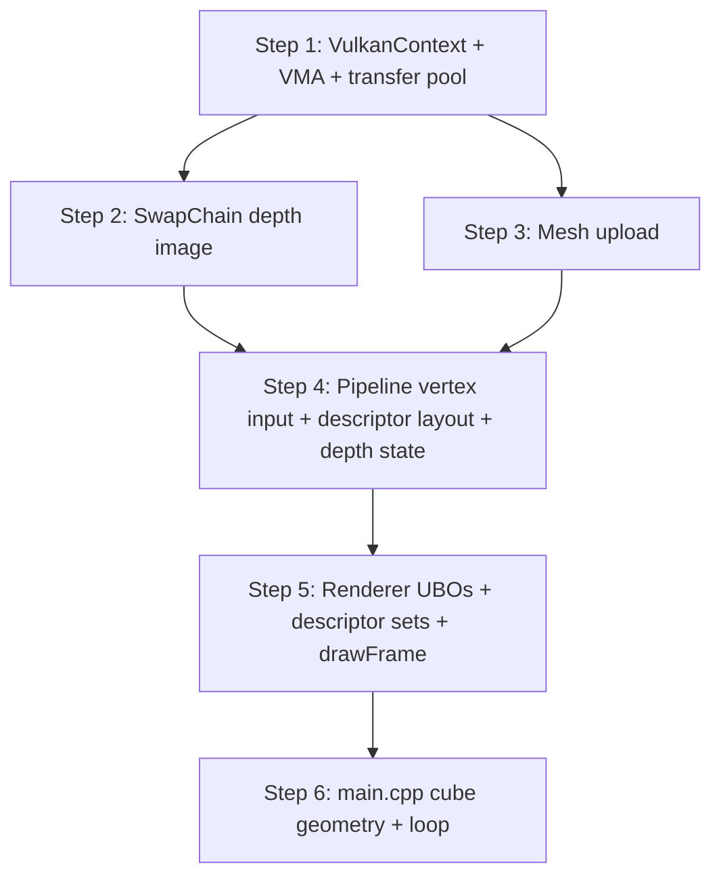

# M2 Plan — Rotating 3D Cube

> [!abstract] Milestone Goal
> Render a textured-ready 3D cube that rotates continuously on screen, using real vertex/index buffers uploaded to device-local GPU memory, a depth buffer for correct occlusion, and a UBO-driven MVP matrix for the camera and rotation transforms.

**Depends on:** [[2026-04-10]] (M1 verified and clean)
**Target:** Week 3–4

---

## What M2 Introduces (vs M1)

| Concept | New in M2 | Why it matters |
|---------|-----------|----------------|
| **VMA** | Yes | All GPU buffer/image allocation goes through it |
| **Staging buffer upload** | Yes | Vertices/indices reach device-local memory via a copy |
| **Depth buffer** | Yes | Prevents back faces showing through front faces |
| **Vertex input bindings** | Yes | Pipeline now reads from a real `VkBuffer` |
| **UBO + Descriptor sets** | Yes | MVP matrix delivered to the vertex shader |
| **`vkCmdDrawIndexed`** | Yes | Replaces `vkCmdDraw(3)` — uses an index buffer |
| **`mesh.vert` / `pbr.frag`** | Active | Replaces `triangle.vert/.frag` |

---

## Concepts to Understand Before Coding

> [!tip] Learn These First
> Attempting M2 without understanding VMA and descriptor sets leads to painful debugging. Spend a session on each before touching code.

### 1 — VMA (VulkanMemoryAllocator)

Raw Vulkan requires manually querying `vkGetPhysicalDeviceMemoryProperties`, picking a heap, and calling `vkAllocateMemory`. VMA automates all of this.

**Key calls:**
```cpp
vmaCreateAllocator(&allocatorCreateInfo, &allocator);

// Create a buffer + its memory in one call:
vmaCreateBuffer(allocator, &bufferInfo, &allocInfo, &buffer, &allocation, nullptr);

// Map memory to a CPU pointer:
vmaMapMemory(allocator, allocation, &data);
memcpy(data, src, size);
vmaUnmapMemory(allocator, allocation);

// Destroy buffer + memory in one call:
vmaDestroyBuffer(allocator, buffer, allocation);
```

**`VmaMemoryUsage` values used in M2:**
- `VMA_MEMORY_USAGE_AUTO` + `VMA_ALLOCATION_CREATE_HOST_ACCESS_SEQUENTIAL_WRITE_BIT` — CPU-writable staging buffer
- `VMA_MEMORY_USAGE_AUTO` — driver picks best heap for device-local buffers/images

### 2 — Staging Buffer Pattern

Device-local memory is fastest for the GPU but ==cannot be written by the CPU==. The pattern is:

```
CPU writes → staging buffer (host visible) → GPU copies → device-local buffer
```

Steps:
1. Create staging buffer (`TRANSFER_SRC | HOST_ACCESS`)
2. Map → memcpy → unmap
3. Create device-local buffer (`TRANSFER_DST | VERTEX_BUFFER`)
4. One-time command buffer: `vkCmdCopyBuffer(staging → device)`
5. Submit + `vkQueueWaitIdle`
6. Destroy staging buffer

### 3 — Descriptor Sets

Descriptors are how shaders access resources (UBOs, textures). The three objects:

```
VkDescriptorSetLayout  — blueprint: "set 0 has a UBO at binding 0"
VkDescriptorPool       — allocator: pre-allocates space for N descriptor sets
VkDescriptorSet        — instance: bound to specific VkBuffer / VkImageView
```

For M2 (UBO only):
```
set = 0, binding = 0, VK_DESCRIPTOR_TYPE_UNIFORM_BUFFER, vertex stage
```

One `VkDescriptorSet` per in-flight frame (so each frame has its own UBO copy — no race conditions).

### 4 — Depth Buffer

A depth buffer is a `VkImage` with format `VK_FORMAT_D32_SFLOAT` (32-bit float depth). The GPU writes a depth value per pixel and discards fragments that are behind already-written geometry.

- Created alongside the swapchain (same width/height, rebuilt on resize)
- Allocated via VMA (`GPU_ONLY`)
- Layout: `UNDEFINED → DEPTH_STENCIL_ATTACHMENT_OPTIMAL` via a barrier before rendering
- Added to `VkRenderingInfo.pDepthAttachment` alongside the colour attachment
- Pipeline needs `VkPipelineDepthStencilStateCreateInfo` with `depthTestEnable = VK_TRUE`, `depthWriteEnable = VK_TRUE`, `compareOp = VK_COMPARE_OP_LESS`

---

## Files to Modify — Overview

```
src/VulkanContext.h   — add VmaAllocator member + accessor
src/VulkanContext.cpp — init/destroy VMA after/before device
src/SwapChain.h       — add depth image/view/allocation + FORMAT constant
src/SwapChain.cpp     — create depth image in init(), destroy in destroy()
src/Mesh.h            — add VmaAllocation members, update upload() signature
src/Mesh.cpp          — full staging upload implementation
src/Pipeline.h/cpp    — vertex input, descriptor layout, depth state
src/Renderer.h        — add UBO buffers, descriptor pool/sets, update drawFrame()
src/Renderer.cpp      — UBO update, depth barrier, indexed draw
src/main.cpp          — cube geometry, mesh upload, angle tracking
```

---

## Step 1 — VulkanContext: Add VMA

> [!warning] Do This First
> Every other M2 feature needs `ctx.allocator()`. Implement and test this step before anything else.

### `VulkanContext.h` changes

Add include and member:
```cpp
#include <vk_mem_alloc.h>

// In private:
VmaAllocator m_allocator = VK_NULL_HANDLE;

// In public accessors:
/// @brief Returns the VMA allocator handle.
VmaAllocator allocator() const { return m_allocator; }
```

### `VulkanContext.cpp` changes

In `init()`, after Stage 4 (device creation), add Stage 5.5:
```cpp
// ── Stage 5.5: VMA Allocator ──────────────────────────────────────────
VmaAllocatorCreateInfo allocatorInfo{};
allocatorInfo.instance       = m_instance;
allocatorInfo.physicalDevice = m_physicalDevice;
allocatorInfo.device         = m_device;
allocatorInfo.vulkanApiVersion = VK_API_VERSION_1_3;
// bufferDeviceAddress was required in Stage 3 — enable the matching VMA flag:
allocatorInfo.flags = VMA_ALLOCATOR_CREATE_BUFFER_DEVICE_ADDRESS_BIT;

if (vmaCreateAllocator(&allocatorInfo, &m_allocator) != VK_SUCCESS) {
    spdlog::error("VulkanContext: failed to create VMA allocator");
    return false;
}
spdlog::info("VulkanContext: VMA allocator created");
```

In `destroy()`, before device destruction (VMA must go before the device):
```cpp
if (m_allocator != VK_NULL_HANDLE) {
    vmaDestroyAllocator(m_allocator);
    m_allocator = VK_NULL_HANDLE;
}
```

---

## Step 2 — SwapChain: Add Depth Image

### `SwapChain.h` changes

```cpp
#include <vk_mem_alloc.h>

// Public:
/// @brief Format used for the depth attachment (D32_SFLOAT — 32-bit float, no stencil).
static constexpr VkFormat DEPTH_FORMAT = VK_FORMAT_D32_SFLOAT;

/// @brief Returns the depth image view for use in VkRenderingInfo.
VkImageView depthView() const { return m_depthView; }

// Private:
VkImage       m_depthImage      = VK_NULL_HANDLE;
VkImageView   m_depthView       = VK_NULL_HANDLE;
VmaAllocation m_depthAllocation = nullptr;
```

### `SwapChain.cpp` changes

At the end of `init()`, after image views are created:
```cpp
// ── Depth image ───────────────────────────────────────────────────────
VkImageCreateInfo depthInfo{VK_STRUCTURE_TYPE_IMAGE_CREATE_INFO};
depthInfo.imageType   = VK_IMAGE_TYPE_2D;
depthInfo.format      = DEPTH_FORMAT;
depthInfo.extent      = {m_extent.width, m_extent.height, 1};
depthInfo.mipLevels   = 1;
depthInfo.arrayLayers = 1;
depthInfo.samples     = VK_SAMPLE_COUNT_1_BIT;
depthInfo.tiling      = VK_IMAGE_TILING_OPTIMAL;
depthInfo.usage       = VK_IMAGE_USAGE_DEPTH_STENCIL_ATTACHMENT_BIT;

VmaAllocationCreateInfo depthAllocInfo{};
depthAllocInfo.usage = VMA_MEMORY_USAGE_AUTO;   // driver picks GPU-only heap

if (vmaCreateImage(ctx.allocator(), &depthInfo, &depthAllocInfo,
                   &m_depthImage, &m_depthAllocation, nullptr) != VK_SUCCESS) {
    spdlog::error("SwapChain: failed to create depth image");
    return false;
}

VkImageViewCreateInfo depthViewInfo{VK_STRUCTURE_TYPE_IMAGE_VIEW_CREATE_INFO};
depthViewInfo.image    = m_depthImage;
depthViewInfo.viewType = VK_IMAGE_VIEW_TYPE_2D;
depthViewInfo.format   = DEPTH_FORMAT;
depthViewInfo.subresourceRange = {VK_IMAGE_ASPECT_DEPTH_BIT, 0, 1, 0, 1};

if (vkCreateImageView(ctx.device(), &depthViewInfo, nullptr, &m_depthView) != VK_SUCCESS) {
    spdlog::error("SwapChain: failed to create depth image view");
    return false;
}
spdlog::info("SwapChain: depth image created (D32_SFLOAT)");
```

In `destroy()`, before swapchain destruction:
```cpp
if (m_depthView != VK_NULL_HANDLE) {
    vkDestroyImageView(ctx.device(), m_depthView, nullptr);
    m_depthView = VK_NULL_HANDLE;
}
if (m_depthImage != VK_NULL_HANDLE) {
    vmaDestroyImage(ctx.allocator(), m_depthImage, m_depthAllocation);
    m_depthImage      = VK_NULL_HANDLE;
    m_depthAllocation = nullptr;
}
```

> [!note] `destroy()` needs `ctx` to access the allocator
> The current signature `destroy(const VulkanContext& ctx)` already passes `ctx` — no change needed.

---

## Step 3 — Mesh: Staging Upload

### `Mesh.h` changes

Add VMA includes and allocation members:
```cpp
#include <vk_mem_alloc.h>

// Update upload() to take the context:
bool upload(const VulkanContext&        ctx,
            const std::vector<Vertex>&   vertices,
            const std::vector<uint32_t>& indices);

// Private: add allocation handles alongside buffers
VmaAllocation m_vertexAllocation = nullptr;
VmaAllocation m_indexAllocation  = nullptr;
```

`destroy()` also needs `ctx`:
```cpp
void destroy(const VulkanContext& ctx);
```

### `Mesh.cpp` — implement `upload()`

Use a private helper `oneTimeSubmit()` for the copy command:

```cpp
// Helper: allocate, record one command, submit, wait, free
static void oneTimeSubmit(const VulkanContext& ctx,
                          std::function<void(VkCommandBuffer)> fn)
{
    VkCommandBufferAllocateInfo allocInfo{VK_STRUCTURE_TYPE_COMMAND_BUFFER_ALLOCATE_INFO};
    allocInfo.commandPool        = /* need a transfer pool or pass one in */;
    allocInfo.level              = VK_COMMAND_BUFFER_LEVEL_PRIMARY;
    allocInfo.commandBufferCount = 1;

    VkCommandBuffer cmd;
    vkAllocateCommandBuffers(ctx.device(), &allocInfo, &cmd);

    VkCommandBufferBeginInfo begin{VK_STRUCTURE_TYPE_COMMAND_BUFFER_BEGIN_INFO};
    begin.flags = VK_COMMAND_BUFFER_USAGE_ONE_TIME_SUBMIT_BIT;
    vkBeginCommandBuffer(cmd, &begin);
    fn(cmd);
    vkEndCommandBuffer(cmd);

    VkSubmitInfo submit{VK_STRUCTURE_TYPE_SUBMIT_INFO};
    submit.commandBufferCount = 1;
    submit.pCommandBuffers    = &cmd;
    vkQueueSubmit(ctx.graphicsQueue(), 1, &submit, VK_NULL_HANDLE);
    vkQueueWaitIdle(ctx.graphicsQueue());

    vkFreeCommandBuffers(ctx.device(), pool, 1, &cmd);
}
```

> [!warning] Transfer Command Pool
> `Mesh::upload()` needs a command pool to allocate the one-time transfer buffer. Options:
> - Pass a `VkCommandPool` parameter to `upload()`
> - Add a transfer command pool to `VulkanContext`
> - Reuse the Renderer's command pool (not great — coupling)
>
> **Recommended:** Add a `m_transferPool` to `VulkanContext` in Step 1 alongside VMA. One extra pool, clean ownership.

**`upload()` body:**
```cpp
bool Mesh::upload(const VulkanContext& ctx,
                  const std::vector<Vertex>&   vertices,
                  const std::vector<uint32_t>& indices)
{
    const VkDeviceSize vertBytes = vertices.size() * sizeof(Vertex);
    const VkDeviceSize idxBytes  = indices.size()  * sizeof(uint32_t);

    // ── Staging buffers (host visible, transfer source) ───────────────
    auto makeStaging = [&](VkDeviceSize size, VkBuffer& buf, VmaAllocation& alloc) {
        VkBufferCreateInfo info{VK_STRUCTURE_TYPE_BUFFER_CREATE_INFO};
        info.size  = size;
        info.usage = VK_BUFFER_USAGE_TRANSFER_SRC_BIT;

        VmaAllocationCreateInfo ai{};
        ai.usage = VMA_MEMORY_USAGE_AUTO;
        ai.flags = VMA_ALLOCATION_CREATE_HOST_ACCESS_SEQUENTIAL_WRITE_BIT
                 | VMA_ALLOCATION_CREATE_MAPPED_BIT;

        VmaAllocationInfo mapInfo;
        return vmaCreateBuffer(ctx.allocator(), &info, &ai, &buf, &alloc, &mapInfo);
        // mapInfo.pMappedData is the CPU pointer (always mapped, no map/unmap needed)
    };

    VkBuffer      stagingVert, stagingIdx;
    VmaAllocation stagingVertAlloc, stagingIdxAlloc;
    makeStaging(vertBytes, stagingVert, stagingVertAlloc);
    makeStaging(idxBytes,  stagingIdx,  stagingIdxAlloc);

    // Copy CPU data into staging buffers (via VMA persistent map)
    VmaAllocationInfo vertInfo, idxInfo;
    vmaGetAllocationInfo(ctx.allocator(), stagingVertAlloc, &vertInfo);
    vmaGetAllocationInfo(ctx.allocator(), stagingIdxAlloc,  &idxInfo);
    memcpy(vertInfo.pMappedData, vertices.data(), vertBytes);
    memcpy(idxInfo.pMappedData,  indices.data(),  idxBytes);

    // ── Device-local buffers (GPU only, transfer destination) ─────────
    auto makeDeviceLocal = [&](VkDeviceSize size, VkBufferUsageFlags usage,
                               VkBuffer& buf, VmaAllocation& alloc) {
        VkBufferCreateInfo info{VK_STRUCTURE_TYPE_BUFFER_CREATE_INFO};
        info.size  = size;
        info.usage = VK_BUFFER_USAGE_TRANSFER_DST_BIT | usage;

        VmaAllocationCreateInfo ai{};
        ai.usage = VMA_MEMORY_USAGE_AUTO;

        return vmaCreateBuffer(ctx.allocator(), &info, &ai, &buf, &alloc, nullptr);
    };

    makeDeviceLocal(vertBytes, VK_BUFFER_USAGE_VERTEX_BUFFER_BIT,
                    m_vertexBuffer, m_vertexAllocation);
    makeDeviceLocal(idxBytes,  VK_BUFFER_USAGE_INDEX_BUFFER_BIT,
                    m_indexBuffer,  m_indexAllocation);

    // ── GPU copy (one-time command buffer) ────────────────────────────
    // (using ctx.transferPool() — see Step 1 addition)
    VkCommandBuffer cmd = /* begin one-time */;
    VkBufferCopy vertCopy{0, 0, vertBytes};
    VkBufferCopy idxCopy {0, 0, idxBytes};
    vkCmdCopyBuffer(cmd, stagingVert, m_vertexBuffer, 1, &vertCopy);
    vkCmdCopyBuffer(cmd, stagingIdx,  m_indexBuffer,  1, &idxCopy);
    /* end, submit, wait idle */

    // ── Cleanup staging ───────────────────────────────────────────────
    vmaDestroyBuffer(ctx.allocator(), stagingVert, stagingVertAlloc);
    vmaDestroyBuffer(ctx.allocator(), stagingIdx,  stagingIdxAlloc);

    m_vertexCount = static_cast<uint32_t>(vertices.size());
    m_indexCount  = static_cast<uint32_t>(indices.size());
    return true;
}
```

**`bind()` and `draw()`:**
```cpp
void Mesh::bind(VkCommandBuffer cmd) const {
    VkDeviceSize offset = 0;
    vkCmdBindVertexBuffers(cmd, 0, 1, &m_vertexBuffer, &offset);
    vkCmdBindIndexBuffer(cmd, m_indexBuffer, 0, VK_INDEX_TYPE_UINT32);
}

void Mesh::draw(VkCommandBuffer cmd) const {
    vkCmdDrawIndexed(cmd, m_indexCount, 1, 0, 0, 0);
}
```

---

## Step 4 — Pipeline: Vertex Input + Descriptor Layout + Depth

### `Pipeline.cpp` — `init()` changes

**4a — Vertex input (replace the empty struct):**
```cpp
// Binding: one buffer at binding 0, stride = sizeof(Vertex), per-vertex rate
VkVertexInputBindingDescription binding{};
binding.binding   = 0;
binding.stride    = sizeof(Vertex);
binding.inputRate = VK_VERTEX_INPUT_RATE_VERTEX;

// Attributes: location matches mesh.vert layout qualifiers
VkVertexInputAttributeDescription attrs[3]{};
attrs[0] = {0, 0, VK_FORMAT_R32G32B32_SFLOAT, offsetof(Vertex, position)};  // location 0
attrs[1] = {1, 0, VK_FORMAT_R32G32B32_SFLOAT, offsetof(Vertex, normal)};    // location 1
attrs[2] = {2, 0, VK_FORMAT_R32G32_SFLOAT,    offsetof(Vertex, texCoord)};  // location 2

VkPipelineVertexInputStateCreateInfo vertexInput{
    VK_STRUCTURE_TYPE_PIPELINE_VERTEX_INPUT_STATE_CREATE_INFO};
vertexInput.vertexBindingDescriptionCount   = 1;
vertexInput.pVertexBindingDescriptions      = &binding;
vertexInput.vertexAttributeDescriptionCount = 3;
vertexInput.pVertexAttributeDescriptions    = attrs;
```

**4b — Descriptor set layout (set 0, binding 0 = MVP UBO):**
```cpp
VkDescriptorSetLayoutBinding uboBinding{};
uboBinding.binding         = 0;
uboBinding.descriptorType  = VK_DESCRIPTOR_TYPE_UNIFORM_BUFFER;
uboBinding.descriptorCount = 1;
uboBinding.stageFlags      = VK_SHADER_STAGE_VERTEX_BIT;

VkDescriptorSetLayoutCreateInfo layoutInfo{
    VK_STRUCTURE_TYPE_DESCRIPTOR_SET_LAYOUT_CREATE_INFO};
layoutInfo.bindingCount = 1;
layoutInfo.pBindings    = &uboBinding;
vkCreateDescriptorSetLayout(ctx.device(), &layoutInfo, nullptr, &m_descriptorSetLayout);
```

Update pipeline layout to reference it:
```cpp
VkPipelineLayoutCreateInfo pipelineLayoutInfo{VK_STRUCTURE_TYPE_PIPELINE_LAYOUT_CREATE_INFO};
pipelineLayoutInfo.setLayoutCount = 1;
pipelineLayoutInfo.pSetLayouts    = &m_descriptorSetLayout;
```

**4c — Depth-stencil state (new struct, not present in M1):**
```cpp
VkPipelineDepthStencilStateCreateInfo depthStencil{
    VK_STRUCTURE_TYPE_PIPELINE_DEPTH_STENCIL_STATE_CREATE_INFO};
depthStencil.depthTestEnable  = VK_TRUE;
depthStencil.depthWriteEnable = VK_TRUE;
depthStencil.depthCompareOp   = VK_COMPARE_OP_LESS;  // closer = smaller depth = pass

// Add to VkGraphicsPipelineCreateInfo:
pipelineInfo.pDepthStencilState = &depthStencil;
```

**4d — Depth format in VkPipelineRenderingCreateInfo:**
```cpp
VkFormat depthFmt = SwapChain::DEPTH_FORMAT;
renderingInfo.depthAttachmentFormat = depthFmt;
```

---

## Step 5 — Renderer: UBOs + Descriptor Sets + Updated drawFrame

### `Renderer.h` changes

```cpp
#include <vk_mem_alloc.h>
#include <glm/glm.hpp>

// UBO struct (matches mesh.vert layout)
struct UniformBufferObject {
    glm::mat4 model;
    glm::mat4 view;
    glm::mat4 proj;
};

class Mesh; // forward declare

// Additional private members:
VkDescriptorPool m_descriptorPool = VK_NULL_HANDLE;
VkDescriptorSet  m_descriptorSets[MAX_FRAMES_IN_FLIGHT] = {};
VkBuffer         m_uboBuffers[MAX_FRAMES_IN_FLIGHT]     = {};
VmaAllocation    m_uboAllocations[MAX_FRAMES_IN_FLIGHT] = {};
void*            m_uboMapped[MAX_FRAMES_IN_FLIGHT]      = {}; // persistent map

// Updated drawFrame() signature:
bool drawFrame(const VulkanContext& ctx,
               SwapChain&           swap,
               const Pipeline&      pipeline,
               const Mesh&          mesh,
               float                angle);
```

### `Renderer.cpp` — `init()` additions

Create descriptor pool and per-frame UBO buffers:
```cpp
// ── Descriptor pool ───────────────────────────────────────────────────
VkDescriptorPoolSize poolSize{VK_DESCRIPTOR_TYPE_UNIFORM_BUFFER, MAX_FRAMES_IN_FLIGHT};
VkDescriptorPoolCreateInfo poolInfo{VK_STRUCTURE_TYPE_DESCRIPTOR_POOL_CREATE_INFO};
poolInfo.maxSets       = MAX_FRAMES_IN_FLIGHT;
poolInfo.poolSizeCount = 1;
poolInfo.pPoolSizes    = &poolSize;
vkCreateDescriptorPool(ctx.device(), &poolInfo, nullptr, &m_descriptorPool);

// ── UBO buffers (one per frame, persistent map) ───────────────────────
for (uint32_t i = 0; i < MAX_FRAMES_IN_FLIGHT; ++i) {
    VkBufferCreateInfo bufInfo{VK_STRUCTURE_TYPE_BUFFER_CREATE_INFO};
    bufInfo.size  = sizeof(UniformBufferObject);
    bufInfo.usage = VK_BUFFER_USAGE_UNIFORM_BUFFER_BIT;

    VmaAllocationCreateInfo ai{};
    ai.usage = VMA_MEMORY_USAGE_AUTO;
    ai.flags = VMA_ALLOCATION_CREATE_HOST_ACCESS_SEQUENTIAL_WRITE_BIT
             | VMA_ALLOCATION_CREATE_MAPPED_BIT;

    VmaAllocationInfo mapInfo;
    vmaCreateBuffer(ctx.allocator(), &bufInfo, &ai,
                    &m_uboBuffers[i], &m_uboAllocations[i], &mapInfo);
    m_uboMapped[i] = mapInfo.pMappedData; // always-mapped pointer
}

// ── Allocate descriptor sets ──────────────────────────────────────────
VkDescriptorSetLayout layouts[MAX_FRAMES_IN_FLIGHT];
std::fill(layouts, layouts + MAX_FRAMES_IN_FLIGHT, pipeline.descriptorSetLayout());
// Wait — Renderer::init() doesn't have the pipeline yet.
// Solution: pass Pipeline to init() or allocate sets in drawFrame on first use.
// Simplest: add Pipeline& parameter to Renderer::init().
```

> [!bug] Chicken-and-egg: Descriptor Sets Need the Layout
> `Renderer::init()` needs `Pipeline::descriptorSetLayout()` to allocate descriptor sets, but `Pipeline` is initialised after `Renderer` in `main.cpp`. Fix: pass `const Pipeline& pipeline` to `Renderer::init()`, or initialise in the order `VulkanContext → SwapChain → Pipeline → Renderer` (already the case — just add Pipeline to init's signature).

### `Renderer.cpp` — `drawFrame()` additions

**Update UBO before recording:**
```cpp
UniformBufferObject ubo{};
ubo.model = glm::rotate(glm::mat4(1.0f), angle, glm::vec3(0.5f, 1.0f, 0.0f));
ubo.view  = glm::lookAt(glm::vec3(2.0f, 2.0f, 2.0f),
                         glm::vec3(0.0f, 0.0f, 0.0f),
                         glm::vec3(0.0f, 1.0f, 0.0f));
float aspect = static_cast<float>(swap.extent().width) / swap.extent().height;
ubo.proj  = glm::perspective(glm::radians(45.0f), aspect, 0.1f, 100.0f);
ubo.proj[1][1] *= -1.0f; // GLM was designed for OpenGL — flip Y for Vulkan
memcpy(m_uboMapped[m_currentFrame], &ubo, sizeof(ubo));
```

**Depth barrier (before `vkCmdBeginRendering`):**
```cpp
VkImageMemoryBarrier2 depthBarrier{VK_STRUCTURE_TYPE_IMAGE_MEMORY_BARRIER_2};
depthBarrier.srcStageMask  = VK_PIPELINE_STAGE_2_TOP_OF_PIPE_BIT;
depthBarrier.srcAccessMask = 0;
depthBarrier.dstStageMask  = VK_PIPELINE_STAGE_2_EARLY_FRAGMENT_TESTS_BIT;
depthBarrier.dstAccessMask = VK_ACCESS_2_DEPTH_STENCIL_ATTACHMENT_WRITE_BIT
                           | VK_ACCESS_2_DEPTH_STENCIL_ATTACHMENT_READ_BIT;
depthBarrier.oldLayout     = VK_IMAGE_LAYOUT_UNDEFINED;  // discard each frame
depthBarrier.newLayout     = VK_IMAGE_LAYOUT_DEPTH_STENCIL_ATTACHMENT_OPTIMAL;
depthBarrier.image         = /* swap.depthImage() — add accessor */;
depthBarrier.subresourceRange = {VK_IMAGE_ASPECT_DEPTH_BIT, 0, 1, 0, 1};
```

**Depth attachment in `VkRenderingInfo`:**
```cpp
VkRenderingAttachmentInfo depthAttach{VK_STRUCTURE_TYPE_RENDERING_ATTACHMENT_INFO};
depthAttach.imageView   = swap.depthView();
depthAttach.imageLayout = VK_IMAGE_LAYOUT_DEPTH_STENCIL_ATTACHMENT_OPTIMAL;
depthAttach.loadOp      = VK_ATTACHMENT_LOAD_OP_CLEAR;
depthAttach.storeOp     = VK_ATTACHMENT_STORE_OP_DONT_CARE; // no need to preserve depth
depthAttach.clearValue.depthStencil = {1.0f, 0};            // clear to max depth

renderingInfo.pDepthAttachment = &depthAttach;
```

**Bind descriptor set + draw:**
```cpp
vkCmdBindDescriptorSets(cmd, VK_PIPELINE_BIND_POINT_GRAPHICS,
                          pipeline.layout(), 0, 1,
                          &m_descriptorSets[m_currentFrame], 0, nullptr);
mesh.bind(cmd);
mesh.draw(cmd);  // vkCmdDrawIndexed
```

---

## Step 6 — main.cpp: Cube Geometry + Render Loop

### Cube vertex data

24 vertices (4 per face × 6 faces) with correct per-face normals and UVs:

```cpp
const std::vector<Vertex> cubeVertices = {
    // Front  (z = +0.5, normal = 0,0,1)
    {{-0.5f,-0.5f, 0.5f}, {0,0,1}, {0,0}}, {{ 0.5f,-0.5f, 0.5f}, {0,0,1}, {1,0}},
    {{ 0.5f, 0.5f, 0.5f}, {0,0,1}, {1,1}}, {{-0.5f, 0.5f, 0.5f}, {0,0,1}, {0,1}},
    // Back   (z = -0.5, normal = 0,0,-1)
    {{ 0.5f,-0.5f,-0.5f}, {0,0,-1},{0,0}}, {{-0.5f,-0.5f,-0.5f}, {0,0,-1},{1,0}},
    {{-0.5f, 0.5f,-0.5f}, {0,0,-1},{1,1}}, {{ 0.5f, 0.5f,-0.5f}, {0,0,-1},{0,1}},
    // Right  (x = +0.5, normal = 1,0,0)
    {{ 0.5f,-0.5f, 0.5f}, {1,0,0}, {0,0}}, {{ 0.5f,-0.5f,-0.5f}, {1,0,0}, {1,0}},
    {{ 0.5f, 0.5f,-0.5f}, {1,0,0}, {1,1}}, {{ 0.5f, 0.5f, 0.5f}, {1,0,0}, {0,1}},
    // Left   (x = -0.5, normal = -1,0,0)
    {{-0.5f,-0.5f,-0.5f},{-1,0,0},{0,0}}, {{-0.5f,-0.5f, 0.5f},{-1,0,0},{1,0}},
    {{-0.5f, 0.5f, 0.5f},{-1,0,0},{1,1}}, {{-0.5f, 0.5f,-0.5f},{-1,0,0},{0,1}},
    // Top    (y = +0.5, normal = 0,1,0)
    {{-0.5f, 0.5f, 0.5f}, {0,1,0}, {0,0}}, {{ 0.5f, 0.5f, 0.5f}, {0,1,0}, {1,0}},
    {{ 0.5f, 0.5f,-0.5f}, {0,1,0}, {1,1}}, {{-0.5f, 0.5f,-0.5f}, {0,1,0}, {0,1}},
    // Bottom (y = -0.5, normal = 0,-1,0)
    {{-0.5f,-0.5f,-0.5f}, {0,-1,0},{0,0}}, {{ 0.5f,-0.5f,-0.5f}, {0,-1,0},{1,0}},
    {{ 0.5f,-0.5f, 0.5f}, {0,-1,0},{1,1}}, {{-0.5f,-0.5f, 0.5f}, {0,-1,0},{0,1}},
};

const std::vector<uint32_t> cubeIndices = {
     0, 1, 2,  2, 3, 0,   // front
     4, 5, 6,  6, 7, 4,   // back
     8, 9,10, 10,11, 8,   // right
    12,13,14, 14,15,12,   // left
    16,17,18, 18,19,16,   // top
    20,21,22, 22,23,20,   // bottom
};
```

### Render loop — angle tracking

```cpp
#include <chrono>

auto startTime = std::chrono::high_resolution_clock::now();

while (!glfwWindowShouldClose(window)) {
    glfwPollEvents();
    // ... minimise check ...

    auto now   = std::chrono::high_resolution_clock::now();
    float t    = std::chrono::duration<float>(now - startTime).count();
    float angle = t * glm::radians(90.0f); // 90°/sec rotation

    if (!renderer.drawFrame(ctx, swap, pipeline, cube, angle)) {
        // ... rebuild as before ...
    }
}
```

---

## The Y-Flip Explained

> [!info] Why `ubo.proj[1][1] *= -1`?
> GLM's `glm::perspective()` produces a projection matrix for OpenGL, where the Y axis points up in clip space. Vulkan's clip space has Y pointing **down**. Without the flip, the cube appears upside-down.
>
> `GLM_FORCE_DEPTH_ZERO_TO_ONE` (already defined in CMake) fixes the depth range [0,1] but does **not** fix the Y axis — that must be done manually.

---

## Implementation Order



---

## Verification Checklist

- [ ] **Compiles clean** — zero warnings/errors on both `linux-debug` and `uni-debug`
- [ ] **Cube renders** — all 6 faces visible as rotation reveals them
- [ ] **Depth correct** — back faces hidden behind front faces (no z-fighting)
- [ ] **Rotation smooth** — time-based, not frame-rate-dependent
- [ ] **Resize works** — window drag rebuilds swapchain + depth image, cube continues rotating
- [ ] **Zero validation errors** — startup, runtime, shutdown
- [ ] **Screenshot captured** → `docs/screenshots/M2-cube.png`

---

## Report Sections This Feeds

- **§2 Architecture Overview** — staging buffer pattern, VMA rationale, descriptor set design
- **§3 Pipeline Deep-Dive** — vertex input binding, depth state, descriptor layout
- **§5 Challenges & Solutions** — likely: descriptor set chicken-and-egg, Y-flip, depth barrier stage masks
- **§7 Critical Reflection** — per-frame UBO copies vs push constants trade-off

---

*FYP — Vulkan Renderer in C++20 · Mohamed Deeq Mohamed · P2884884 · De Montfort University*
