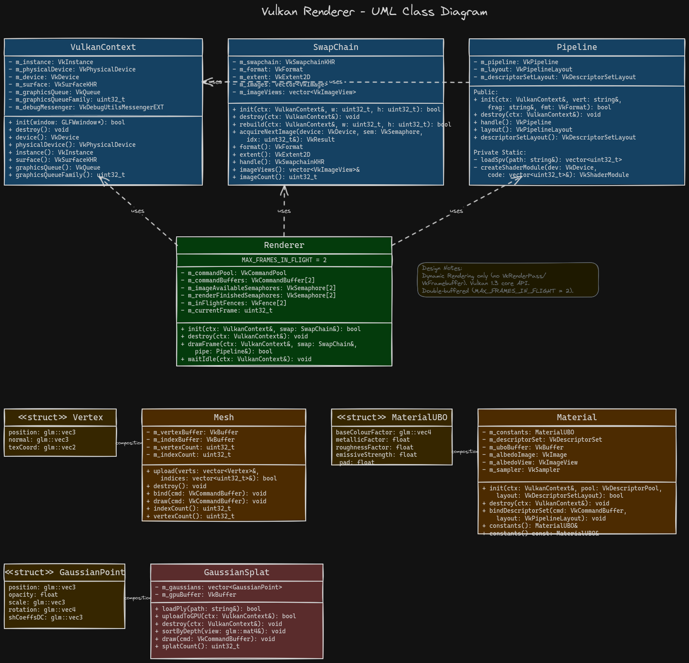

# FYP - Vulkan Renderer in C++20

**Mohamed Deeq Mohamed · P2884884 · De Montfort University · 2025–2026**

> A focused real-time Vulkan 1.3 renderer built in C++20. The project prioritises Dynamic Rendering, explicit synchronisation, one textured OBJ model, simple camera and lighting, resize-safe swapchain handling, and a stretch goal of 3D Gaussian Splatting from `.ply` files only after the core renderer is complete.

> Open this folder as your Obsidian vault: `File → Open vault → docs/FYP-Vault/`

---

## Quick Navigation

| Area               | Link                                 |
| ------------------ | ------------------------------------ |
| Today's Dev Log    | [[02-Dev-Log/2026-03-30]]            |
| Current Plan       | [[01-Plans/Week-1-Day-3-Plan]]       |
| M1 Learnings       | [[03-Learnings/Vulkan-Object-Chain]] |
| Gaussian Splatting | [[Research/Gaussian-Splatting]]      |
| PBR Shading        | [[Research/PBR-Shading]]             |
| Inbox              | [[00-Inbox/]]                        |
| Archive            | [[04-Archive/]]                      |

---

## Project Overview

This project implements a compact Vulkan renderer that demonstrates modern GPU programming concepts at the lowest practical abstraction level. The renderer deliberately avoids legacy Vulkan patterns such as `VkRenderPass` and `VkFramebuffer` in favour of Vulkan 1.3 core features: **Dynamic Rendering**, **synchronization2**, and **VMA** for GPU memory.

The project is scoped as a renderer, not an engine. It does not include physics, ECS, audio, scripting, or editor tooling. The architectural focus is correctness, explicitness, reproducibility, and a clear reportable pipeline from model loading to on-screen output.

**Repository:** [FYP-Vulkan-Renderer on GitHub](https://github.com/Raiju-Deeq/FYP-Vulkan-Renderer)

---

## MoSCoW Milestones

| Milestone | Description                                               | Priority | Target Week   | Status      |
| --------- | --------------------------------------------------------- | -------- | ------------- | ----------- |
| M1        | Baseline pipeline + coloured triangle (Dynamic Rendering) | Must     | Wk 2          | In Progress |
| M2        | One textured OBJ model + simple pipeline expansion        | Must     | Wk 3          | Pending     |
| M3        | Basic camera and lighting                                 | Must     | Wk 4          | Pending     |
| S1        | Resize-safe swapchain handling                            | Should   | Wk 5          | Pending     |
| S2        | Wireframe or debug normals toggle                         | Should   | Wk 5          | Pending     |
| M4        | Technical report and cross-platform build                 | Must     | Wk 6          | Pending     |
| C1        | Mipmap generation                                         | Could    | After M4      | Stretch     |
| C2        | Basic PBR lighting                                        | Could    | After M4      | Stretch     |
| C3        | Gaussian Splatting from `.ply`                            | Could    | Final stretch | Stretch     |

> C3 is hard-gated behind the core renderer being complete and stable.

---

## Architecture

### UML Class Diagram



### Module Responsibilities

| Module          | Role                                                         |
| --------------- | ------------------------------------------------------------ |
| `VulkanContext` | Instance, physical/logical device, graphics queue, surface setup via vk-bootstrap |
| `SwapChain`     | Swapchain, image views, and resize recreation                |
| `Pipeline`      | SPIR-V loading, pipeline layout, graphics pipeline setup     |
| `Renderer`      | Per-frame loop, command buffers, fences, semaphores, rendering flow |
| `Mesh`          | OBJ loading and GPU buffer setup                             |
| `Camera`        | View/projection control and inspection of the mesh           |
| `Material`      | Texture and basic lighting data                              |
| `GaussianSplat` | Stretch goal: `.ply` loading and Gaussian splat rendering    |

### Key Design Decisions

- **Dynamic Rendering only** - no `VkRenderPass`, no `VkFramebuffer`.
- **Explicit synchronisation** - all layout transitions use `VkImageMemoryBarrier2` and `synchronization2`.
- **Double-buffered** - `MAX_FRAMES_IN_FLIGHT = 2` with per-frame semaphores and fences.
- **VMA for GPU memory** - no direct `vkAllocateMemory` calls.
- **vk-bootstrap** - handles instance, device, and swapchain boilerplate.
- **Small, explainable scope** - the core renderer is prioritised over engine-style systems.

---

## Tech Stack

| Tool                    | Purpose                                     |
| ----------------------- | ------------------------------------------- |
| Vulkan 1.3 (LunarG SDK) | Graphics API                                |
| C++20                   | Language standard (RAII throughout)         |
| vk-bootstrap            | Instance / device / swapchain setup         |
| GLFW3                   | Window + input                              |
| GLM                     | Maths                                       |
| VulkanMemoryAllocator   | GPU memory allocation                       |
| tinyobjloader           | OBJ mesh loading                            |
| stb_image               | Texture loading                             |
| spdlog                  | Logging                                     |
| CMake + vcpkg           | Build system + dependency management        |
| Doxygen                 | API documentation                           |
| Dear ImGui              | Optional debug UI for development only      |
| tinyply                 | Optional `.ply` loading for Gaussian splats |

---

## Risk Register

| #    | Risk                                            | Likelihood | Impact | Mitigation                                              |
| ---- | ----------------------------------------------- | ---------- | ------ | ------------------------------------------------------- |
| 1    | Report falling behind implementation            | High       | High   | Begin writing early and keep notes during development   |
| 2    | Vulkan sync errors consuming time               | Medium     | High   | Keep validation layers on and use RenderDoc early       |
| 3    | Swapchain resize handling issues                | Medium     | Medium | Implement resize-safe recreation before polish work     |
| 4    | Scope creep from stretch goals                  | Medium     | High   | Finish core objectives before starting any stretch work |
| 5    | Cross-platform build issues on Linux or Windows | Medium     | High   | Test both environments regularly and keep CMake simple  |
| 6    | `.ply` parsing or splat rendering complexity    | Low        | Medium | Keep Gaussian splats as a final stretch objective only  |

---

## Won't Have

- Not a game engine - no physics, ECS, audio, scripting, or editor tooling.
- No shadow mapping, deferred shading, skeletal animation, or mobile or console support.
- No NeRF training or inference - Gaussian splats use pre-trained `.ply` files only.
- No ray tracing, multi-GPU, portability layers, or Android/iOS support.

---

## Vault Structure

| Folder          | Purpose                                                  |
| --------------- | -------------------------------------------------------- |
| `00-Inbox/`     | Unprocessed notes - sort weekly                          |
| `01-Plans/`     | Milestone roadmaps and daily session plans               |
| `02-Dev-Log/`   | Daily development logs                                   |
| `03-Learnings/` | Concept notes and Vulkan deep-dives                      |
| `04-Archive/`   | Completed milestones and reference material              |
| `Research/`     | Research notes on Gaussian splatting, PBR, and rendering |
| `Images/`       | Diagrams, screenshots, and visual references             |

---

## Claude Code Slash Commands

```
/devlog           → generates today's log → 02-Dev-Log/YYYY-MM-DD.md
/note [topic]     → creates research note → 03-Learnings/[topic].md
/plan [task]      → creates plan doc      → 01-Plans/[task].md
/report [section] → drafts report section from dev logs
/docme [file]     → adds/fixes Doxygen comments on source file
/validate         → runs cmake build + validation layers
```

---

## Weekly Timeline

| Week | Focus                                                        |
| ---- | ------------------------------------------------------------ |
| 1    | Setup, documentation, architecture, and concept learning     |
| 2    | **M1** - Coloured triangle via Dynamic Rendering             |
| 3    | **M2** - Textured OBJ model and pipeline expansion           |
| 4    | **M3** - Basic camera and lighting                           |
| 5    | **S1 / S2** - Resize-safe swapchain and debug visualisation  |
| 6    | **M4** - Cross-platform build, technical report, and final evaluation |
| 7+   | **C1 / C2 / C3** - Mipmaps, PBR, Gaussian splats only if the core is complete |

---

## Project Notes

- The renderer is intentionally minimal so the report can clearly explain each design choice.
- Gaussian splatting is a stretch objective, not a core deliverable.
- The final submission should demonstrate a stable pipeline, a clear learning narrative, and reproducible builds on Linux and Windows.

---

*FYP - Vulkan Renderer in C++20 · Mohamed Deeq Mohamed · P2884884 · De Montfort University*
